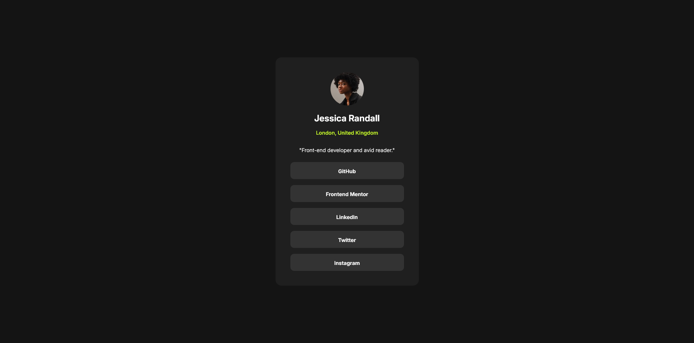

# Frontend Mentor - Social links profile solution

This is a solution to the [Social links profile challenge on Frontend Mentor](https://www.frontendmentor.io/challenges/social-links-profile-UG32l9m6dQ). Frontend Mentor challenges help you improve your coding skills by building realistic projects. 

## Table of contents

- [Overview](#overview)
  - [The challenge](#the-challenge)
  - [Screenshot](#screenshot)
  - [Links](#links)
- [My process](#my-process)
  - [Built with](#built-with)
  - [Continued development](#continued-development)
  - [Useful resources](#useful-resources)
- [Author](#author)

## Overview

### The challenge

Users should be able to:

- See hover and focus states for all interactive elements on the page

### Screenshot

### Links

- Solution URL: (https://github.com/dansuda/social-links-profile-main)
- Live Site URL: (https://dansuda.github.io/social-links-profile-main)

## My process

### Built with

- Semantic HTML5 markup
- CSS custom properties
- Flexbox
- SASS/SCSS

### Continued development

What I want to focus on in the near future is understanding sass/css and it's various syntaxes because of how vast and feature rich it is.

### Useful resources

- (https://www.w3schools.com) - This helped me to understand syntaxes of different properties and values. I really liked this pattern and will use it going forward.
- (https://www.stackoverflow.com) - This is an amazing website which helped me  understand why some workflow methods are better than others. Like how when dealing with online fonts, it's better to use a link tag in the html than importing with the css because the browser favors the former more than the latter. I'd recommend it to anyone who writes code.

## Author

- Github - [dansuda](https://www.github.com/dansuda)
- Frontend Mentor - [@dansuda](https://www.frontendmentor.io/profile/dansuda)